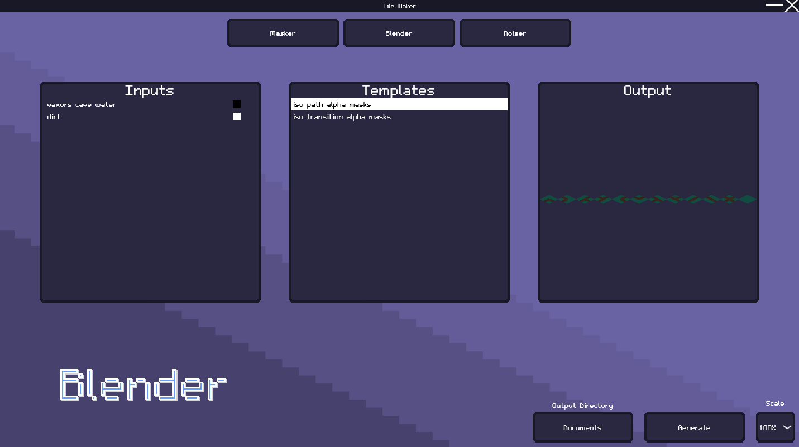
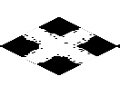

<div align="center">

  <!--  -->
  <h1>Tile Maker</h1>
  
  <p>
    A utility for batch editing game tiles.
  </p>
  
  
   
<h4>
    <a href="https://github.com/BradlyLanducci/tile_maker/issues">Report Bug</a>
  <span> · </span>
    <a href="https://github.com/BradlyLanducci/tile_maker/issues">Request Feature</a>
  </h4>
</div>

<br />

<!-- Table of Contents -->
# Table of Contents

- [Screenshots](#screenshots)
- [Getting Started](#getting-started)
  * [Building](#run-locally)
  * [Usage](#usage)
- [TODO](#todo)
- [FAQ](#faq)
- [Acknowledgements](#acknowledgements)

  

### Screenshots

<div align="center"> 
  
</div>

## 	Getting Started

### Building

Clone the project

```bash
  git clone https://github.com/BradlyLanducci/tile_maker.git
```

Go to the project directory

```bash
  cd tile_maker
```

Create build folder

```bash
  mkdir build
```

Generate CMake files

```bash
  cmake .. -G="Ninja"
```

Build project

```bash
  ninja
```

### Usage

Select an output directory that all generated images will be placed into. When you generate the images it creates all possible combinations of inputs.

- Masker
    + Drag and drop input and mask images. Select an input and mask to see a preview of the generated output.

- Blender
    + Drag and drop input and templates. Templates indicate how it will map colors from the inputs into the output. For example in this image it will map the "vaxors_cave_water" to all black parts of the template and "dirt" to the white. You can use any amount of inputs to blend complex tiles. Select a template to see a preview of the generated output.

<div align="center"> 
  
</div>

- Noiser
    + Applies noise to a tile. You can adjust the noise type, opacity, frequency, and seed. Useful for adding texture to bland tiles.

<!-- FAQ -->
## FAQ

- What?

  + Tile Maker is a *hopefully* easy to use utility for batch generating tiles for game development. It currently has three editors: Masker, Blender, and Noiser.

- Why?

  + For the past year and a half I've been developing an isometric pixel art game, so I made this tool to easily create different transitions between tile types.

## TODO
 - Noise blend modes

## Contact

Bradly Landucci - BradlyLanduci@gmail.com


## Acknowledgements

Thanks to these awesome people.


 - [awesome-readme-template](https://github.com/Louis3797/awesome-readme-template)
 - [stb](https://github.com/nothings/stb)
 - [FastNoiseLite](https://github.com/Auburn/FastNoiseLite)
